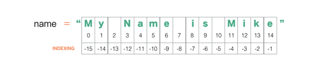

# Unit02 Python中的字符串和列表

## 2.1 字符串的使用及基本操作

### 2.1.1 字符串简介

字符串是Python中最常用的数据类型,字符串就是一系列字符。在Python中，用引号括起的都是字符串，引号相当于字符串的定界符，要成对出现，其中的引号可以是单引号，也可以是双引号。

```python

# 输出Hello World,引号之间的就是字符串,不论使用单引号还是双引号

print('Hello World') # Hello World

# 双引号包裹也可以

print("Hello World") # Hello World

```

创建字符串特别简单：

```python

# 创建一个字符串

string1 = '' # 空字符串

username = 'domi'

addr = '北京'

sex = '女'

# 输出下相关变量的值

print(string1) # 空字符串，什么也看不到

print(username) # domi

print(addr,sex) # 北京 女

```

空字符串是字符串吗？我们在命令行中print(1) 和 print('1') 看到的结果都是1，那我们如何验证一个变量是字符串类型呢？

其实很简单，可以通过type(x)来打印变量的类型：

```python

string1 = ''

print(type(string1)) # <class 'str'> 严格地说，在Python中的字符串是一种对象类型，这种类型用str表示


a = 1

b = '1'

print(type(a),type(b)) # <class 'int'> <class 'str'>

```

定义简单的字符串没有问题了，那现在我想创建一个类似这样的字符串，"I'm Ok" 该如何定义呢？我们应该选择什么作为定界符呢？

```python

# 单引号当定界符

string1 = '"I'm Ok"'

"""
程序已经报错,语法错误
File "<stdin>", line 1
    string1 = '"I'm Ok"'
                  ^
SyntaxError(语法错误): invalid syntax(无效的语法)
"""

# 双引号当定界符

string1 = ""I'm Ok""

"""
程序同样报错
File "<stdin>", line 1
    string1 = ""I'm Ok""
                ^
SyntaxError(语法错误): invalid syntax(无效的语法)
"""

```

不论是使用单引号还是双引号，程序都会产生语法错误，因为当字符串中的内容和定界符冲突的时候计算机就懵逼了，computer搞不清楚该谁包裹谁了，谁和谁是一对的~所以此时需要使用转义符来解决。

### 2.1.2 转义符

所谓转义，就是让某个符号不再表示某个含义，而是表示另外一个含义。转义符的作用就是它能够转变符号的含义。在Python中，用反斜线 \ 作为转义符（其实很多语言，只要有转义符的，都是用这个符号）。

<table>
    <thead>
        <tr>
            <th>转义字符</th>
            <th>描述</th>
        </tr>
    </thead>
    <tbody>
        <tr>
            <td>\(在行尾时)</td>
            <td>续行符</td>
        </tr>
        <tr>
            <td>\\</td>
            <td>反斜杠符号</td>
        </tr>
        <tr>
            <td>\'</td>
            <td>单引号</td>
        </tr>
        <tr>
            <td>\"</td>
            <td>双引号</td>
        </tr>
        <tr>
            <td>\n</td>
            <td>换行</td>
        </tr>
        <tr>
            <td>\r</td>
            <td>回车</td>
        </tr>
        <tr>
            <td>\t</td>
            <td>横向制表符</td>
        </tr>
    </tbody>
</table>

---

以上是常用的转义符，有了这些转义符之后刚刚的问题就迎刃而解了。

```python

# 使用单引号当做定界符，此时内容中的单引号和定界符冲突，需要使用\'进行转义

string1 = '"I\'m Ok"'

print(string1) # "I'm Ok"

# 如果使用双引号当做定界符，此时内容中的双引号需要转义

string1 = "\"I'm Ok\""

print(string1) # "I'm Ok"

```

其它那几个转义符我们也来一一试试。

```python

# 续行符，当字符串很长的时候可以使用一行的末尾使用续行符，接着在下一行继续书写
# 毕竟python推荐一行中最多写79个字符是比较合适的

string1 = 'hello\
world\
!'

print(string1) # helloworld!

# \n代表换行

string1 = 'a\nb\nc\nd'

print(string1)

"""
a
b
c
d
"""

string1 = '\\'

print(string1) # \

```

如果我想输出电脑中的某个文件的绝对路径(Windows电脑)，类似c:\some\name的路径：

```python

print('c:\some\name')

"""
得到的结果类似这样，因为\n代表换行的意思
C:\some
ame
"""

```

一种方式是将字符串中的 \ 转义：

```python

print('c:\\some\\name') # c:\some\name

```

另外一种方法是在第一个引号前面加上一个 r或者 R，代表不对特殊字符进行转义

```python

print(r'c:\some\name') # c:\some\name

print(R'c:\some\name') # c:\some\name

print(r'\\') # \\

```

当我们内容很多的时候，我们想将其放置在多行，这时候可以使用"""..."""三引号的形式。

```python

string1 = """
Good Good Study,
Day Day Up~
"""

print(string1)

"""
发现输出的文本中多了两个空行，因为行尾的换行符会被包含在字符串中，想解决这个问题也很简单，使用在行首和行尾使用续行符即可。

Good Good Study,
Day Day Up~

"""

string1 = """\
Good Good Study,

Day Day Up~

Failure is the fog through which we glimpse triumph.\
"""

print(string1)

"""
此时行首和行尾就不包含换行了
Good Good Study,
Day Day Up~
Failure is the fog through which we glimpse triumph.
"""

```

### 2.1.3 字符串操作符

在字符串中可以做很多操作，这时候就需要配合不同的操作符完成不同的功能。

- \+，拼接字符串
- \*，重复字符串
- []，获取字符串中的指定字符
- [:]，字符串切片操作，形式如[start:end:step]
- in | not in ,成员运算符，检测字符串中是否存在某个值
- %，格式化字符串,str.format()代替%

我们一一来看下这些运算符如何使用。

首先先看拼接字符串，这里想到一个段子：

>小学语文老师布置这样一个题目：请用“不约而同”造句。
>
>一小朋友回答：
>
>我问姐姐，“约吗？”，姐姐说，不约儿童。
>

上面这句话，就是多个字符串连接到了一起。所以，字符串是可以连接起来的。

连接字符串使用 + 号，这个和数学的+不一样，它是用来拼接字符串的。

```python

print("py" + "thon") # python

print("hello" + "world" + "!") # helloworld!

a = 'hello'

b = 'world'

# 等量代换的效果

print(a + b + '!') # helloworld!

username = 'Jordan'

age = 23

print(username + age)

"""
Traceback (most recent call last):
  File "<stdin>", line 1, in <module>
TypeError: cannot concatenate 'str' and 'int' objects
字符串类型不能和整型连接
"""

```

用 + 所连接的两个对象，必须是同一种类型。如果是不同类型的，则"cannot concatenate"或者"unsupported"。

如果两个都是数字，毫无疑问是正确的，就是求和；如果都是字符串，那么就得到一个新的字符串。

那如果想解决这个问题怎么办呢？我们可以通过str()将其它对象转换成字符串对象：

```python

username = 'Jordan'

age = 23

print(username + str(age)) # Jordan23

# 将12转换成字符串

print(str(12)) # 12

# 将68.8转换成字符串

print(str(68.8)) # 68.8

# 将True转换成字符串

print(str(True)) # True

```

还有一种自动连接字符串的方式,相邻的两个字符串文本自动连接在一起:

```python

print('py''thon') # python

print('hello' 'world' '~') # helloworld~

```

注意：它只用于字符串文本，不能用于字符串表达式:

```python

str1 = 'hello'

print(str1 'world')

```

这个功能在你想切分很长的字符串的时候特别有用:

```python

text = ('This is a test '
' hello world ')

print(text) # this is a test hello world

```

---

重复字符串中的内容可以使用*号：

```python

print('hi~') # hi~

# 重复3次hi~

print('hi~' * 3) # hi~hi~hi~

# 输出Google

print('G' + 'o' * 2 + 'gle')

```

---

一个字符串，一般可以有多个字符构成，那么可以操作每个字符吗？这就要索引和切片。

在Python中，把像字符串这样的对象类型（后面还会冒出来类似的其它有这种特点的对象类型，像列表）统称为序列。顾名思义，序列就是“有序排列”。

像水泊梁山的108个好汉，就是一个“有序排列”的序列。从老大宋江一直排到第108位金毛犬段景住。在这个序列中，每个人有编号，编号和每个人一一对应。1号是宋江，2号是卢俊义。反过来，通过每个人的姓名，也能找出他对应的编号。武松是多少号？14号。那武大郎呢？太怂了，没有在108位好汉中^-^~

在Python中，给这些编号取了一个文雅的名字，叫做索引。

如果我们想读取字符串中的指定字符，可以根据字符串中的索引找到对应的字符,形式如str[索引]。

字符串的索引是从0开始的，也就是第一个字符的索引为0，我们可以尝试下：

```python

string = 'python'

# 取出p，对应索引为0

print(string[0]) # p

# 取出h，对应索引3

print(string[3]) # h

# 取出最后一位，对应索引5

print(string[5]) # n

# 当然直接使用字符串效果一样

print('python'[0]) # p

```

如果字符串长度不固定，那取出最后一位就需要得到字符串长度之后再减去1，即可得到最后一位。索引从0开始，所以要减去1。

可以通过len()函数得到字符串的长度：

```python

string1 = 'python'

# 取出最后一位

print(strin1[len(string1)-1]) # n

# 得到string1的长度

print(len(string1)) # 6

string1 = '123456'

print(len(string1)) # 6

string1 = 123

print(len(string1)) # 报错

"""
整型没有len()方法
Traceback (most recent call last):
  File "<stdin>", line 1, in <module>
TypeError: object of type 'int' has no len()
"""

string1 = '123'

print(len(string1)) # 3

```

索引支持负数，代表从右向左查找，最右边的为-1

```python

string1 = 'python'

# 取出最后一位

print(string[-1]) # n

# 取出倒数第三位

print(string[-3]) # h

```

如果索引超出范围，会报错，正向范围要在0~len(str)-1,负数范围在-1~-len(str)

```python

string1 = 'python'

print(string1[6]) # 报错，超出正数范围

"""
Traceback (most recent call last):
  File "<stdin>", line 1, in <module>
IndexError: string index out of range
"""

print(string1[-7]) # 报错，超出负数范围

```

通过索引能够找到该索引所对应的字符，那么反过来，能不能通过字符，找到其在字符串中的索引值呢？怎么找？

可以用字符串的一个方法index()：

```python

string1 = 'python'

string1.index('p') # 0

string1.index('n') # 5

string1.index('z') # 报错

"""
子字符串不存在
Traceback (most recent call last):
  File "<stdin>", line 1, in <module>
ValueError: substring not found
"""

string1.index('on') # 4，当做整体去查找

```

---

字符串也支持切片操作，所谓的切片就是取出子字符串，像我们切肉一样，要从这个🐽身上切下来哪片肉~

用到的形式就是str[起始:结束:步长],切片的时候不包含结束位置的字符




```python

name = 'My Name is Mike'

print(name[0]) # M

print(name[-4]) # M

print(name[0:2]) # My

print(name[3:8]) # Name

print(name[11:14]) # Mik

print(name[11:15]) # Mike

# 如果给定一个过大的索引值(即索引值大于字符串实际长度)将被字符串实际长度所代替

print(name[5:100]) # me is Mike 相当于取到字符串的末尾

# 同样支持负数


print(name[0:-3]) # My Name is M

print(name[0:-5]) # My Name is

print(name[-5:-1]) # Mik

# 如果只给了起始点，则从起始点一直取到字符串的末尾

print(name[0:]) # My Name is Mike

print(name[3:]) # Name is Mike

# 同样也支持负数

print(name[-4:]) # Mike

print(name[-7:]) # is Mike

print(name[100:]) # '' 空字符串

# 如果省略第一个参数，代表从0开始

print(name[:5]) # My Na

print(name[:-3]) # 'My Name is M'

# 如果两个参数都不写，则返回整个字符串

print(name[:]) # My Name is Mike 不要忘了写冒号:

# 还可以设置步长，通过第三个参数

string1 = 'abcdefghijk'

print(string1[::2]) # 等差数列，每隔两个取一个

print(string1[0:5:2]) # ace

print(string1[-6:-1:2]) # fhj

# 步长同样可以为负数，代表从右向左数
# 实现字符串倒置

print(string1[::-1]) # 'kjihgfedcba'

print(string1[::-2]) # kigeca'


```

>1.接着我们可以来做一个文字小游戏叫做一一“找出你朋友中的魔鬼”也就是拼装出fiend。输入代码：
>
>word = 'friends'
>
>find_the_evil_in_your_friends =  word[0] + word[2:4] + word[-3:-1]
>
>print(find_the_evil_in_your_friends)

>2.再来看一个实际项目中的应用，同样是分片的用法。
>'http://ww1.site.cn/14d2e8ejw1exjogbxdxhj20ci0kuwex.jpg'
>'http://ww1.site.cn/85cc87jw1ex23yhwws5j20jg0szmzk.png'
>'http://ww2.site.cn/185cc87jw1ex23ynr1naj20jg0t60wv.jpg'
>'http://ww3.site.cn/185cc87jw1ex23yyvq29j20jg0t6gp4.gif'
>
>在实际项目中切片十分好用。上面几个网址（网址经过处理，所以你是打不开的）是使用 Python 编写爬虫后，从网页中解析出来的部分图片链接，现在总共有500余张附有这样链接的图片要进行下载，也就是说我需要给这500张不同格式的图片（png.jpg,gif）以一个统一的方式进行命名。通过观察规律，决定以链接尾部倒数10个字符的方式进行命名，于是输入代码如下：

```python

url = 'http://ww1.site.cn/14d2e8ejw1exjogbxdxhj20ci0kuwex.jpg'

file_name = url[-10:]

print(file_name) # 0kuwex.jpg

```

**PS:最后注意，所有的切片操作不影响原来的字符串，切片产生的是一个新的子字符串**

---

如果想检测另外一个字符串是否在这个字符串中，可以是用in操作符；检测的结果要么是存在，返回True；要么不存在返回False;常用于字符串搜索。

```python

string1 = 'python'

print('p' in string1) # True

print('H' in string1) # False 搜索的时候区分大小写

print('on' in string1) # True

# not in 代表取反

print('on' not in string1) # False

```


---


接着我们再来看字符串的下一个话题，字符串的格式化输出，这个在开发中也经常用得到。

首先了解下什么是格式化字符串？在wiki百科中有这样的词条：

>格式化字符串，是C、C++等程序设计语言printf类函数中用于指定输出参数的格式与相对位置的字符串参数。其中的转换说明（conversion specification）用于把随后对应的0个或多个函数参数转换为相应的格式输出；格式化字符串中转换说明以外的其它字符原样输出。

在这个定义中，是用C语言作为例子，并且用了其输出函数来说明。在Python中，也有同样的操作。

如果说将维基百科的定义再通俗化，所谓字符串格式化化，就是要先制定一个模板，在这个模板中某个或者某几个地方留出空位来，然后在那些空位填上字符串，并且在显示结果中，字符串要符合空位置所设定的约束条件。

那么，那些空位，需要用一个符号来表示，这个符号通常被叫做占位符（仅仅是占据着那个位置，并不是输出的内容）。

```python

print('I want to study %s' % 'python')

print('My Name is %s ~ My Age is %s' % ('domi',23))

```


在这个字符串中，有一个符号%s,这就是一个占位符，这个占位符可以被其它字符串代替。这是曾经较为常用的一种字符串输出方式。

注意“曾经”，言下之意，现在不怎么太提倡了。的确如此，现在提倡使用字符串的.format()方法，这是Python2.6中开始引入的。所以从现在开始，我们要学会使用string.format()来对字符串进行格式化输出。string.format()使用的方式也特别简单，基本语法是通过 {} 和 : 来代替以前的 % 。

```python

# 可以打开终端，使用help(string.format)来查看帮助手册，要学会查手册，看其语法,因为以后工作中经常要查手册

help(string.format)

"""
Help on built-in function format:

format(...) method of builtins.str instance
    S.format(*args, **kwargs) -> str

    Return a formatted version of S, using substitutions from args and kwargs.
    The substitutions are identified by braces ('{' and '}').
"""

```

S.format(\*args, \*\*kwargs)，重点看括号里面的，\*args表示传入一种类型的参数，\*\*arg表示传入另外一种类型的参数。

又遇到新名词——参数——还是不用搭理它，只管继续——因为“发展是硬道理”！

先尝试阅读文档，不理解也没关系。接着我们通过例子来看看如何使用:

```python

# 第一种形式，没有指定位置，按默认顺序

# 此时指定了两个占位符，{}和format中的值一一对应，按照从左到右的顺序

print('I want to study {} and {}'.format('python','java')) # I want to study python and java

# 第二种形式，设置位置

# 此时0对应format中的第一个值，1对应第二个值

print('I want to study {0} and {1}'.format('python','java')) # I want to study python and java

# format中的第一个值python对应占位符0,java对应1，web对应2，以此类推...

print('{1}-{0}-{0}-{1}-{2}'.format('python','java','web')) # java-python-python-java-web

# 第三种形式，可以使用命名参数，这样就不用去记住索引的顺序了

print('My name is {username} and my age is {age}'.format(username='domi',age=23)) # My name is domi and my age is 23

# 使用命名参数就不用按照顺序了，只用对照着占位符的名称即可

print('I want to study {course} ~ I also want to play the {game}'.format(game='王者荣耀',course='python')) # I want to study python ~ I also want to play the 王者荣耀


# 第四种形式，我们可以使用字典形式设置参数，PS：字典后续我们会学习，先看下形式,不要纠结这种写法，后续会详细的讲

userInfo = {'username':'domi','age':23}

print('My name is {username} and my age is {age}'.format(**userInfo)) # My name is domi and my age is 23

```

既然是讲字符串格式化，就要指定一些格式，让输出的结果符合指定的样式。

接下来在来看一些常用的格式：

```python

print('I like {0} also like {1}'.format('python','cangjingkong')) # I like python also like cangjingkong

# {0:10}代表第一个位置，有10个字符那么长，并且放在这个位置的字符串默认是左对齐的，所以传入python不够10个字符长度，在右边补充了4个空格

print('I like {0:10} also like {1:15}~'.format('python','cangjingkong')) # I like python     also like cangjingkong   ~

# {0:<10},通上，加上<号代表这个位置的字符串是左对齐的，和默认的对齐方式一致

print('I like {0:<10} also like {1:15}~'.format('python','cangjingkong')) # I like python     also like cangjingkong   ~

# {0:>10},加上>号代表这个位置的字符串是右对齐

print('I like {0:>10} also like {1:15}~'.format('python','cangjingkong')) # I like     python also like cangjingkong

# {0:^10},代表两端对齐，会平分剩余的空白

print('I like {0:^10} also like {1:15}~'.format('python','cangjingkong')) # I like   python   also like cangjingkong   ~

# 此时剩余空格为奇数，多余的会加入到右边位置

print('a{0:^6}b'.format('xyz')) # a xyz  b

# 除了补空格以外还可以截取指定长度的字符串来显示

# .2代表截取传入的一个内容的前2个字符

print('I like {0:.2} also like {1:.4}~'.format('python','cangjingkong')) # I like py also like cang~

# 当然也可以组合使用，但是这种方式的可读性不是很高，所以不建议这样使用

print('I like {0:^10.2} also like {1:15.4}~'.format('python','cangjingkong')) # I like     py     also like cang

```

除了可以放置字符串，还可以格式化数字：

```python

# {0:d}d代表整数，{1:f}f代表浮点数

print('My age is {0:d} ~ My Salary is {1:f}'.format(23,56789.1234)) # My age is 23 ~ My Salary is 56789.123400

# 如果不按照指定的格式传入内容会产生错误

print('My age is {0:d} ~ My Salary is {1:f}'.format('23a','56789.1234'))

"""
Traceback (most recent call last):
  File "<stdin>", line 1, in <module>
ValueError: Unknown format code 'd' for object of type 'str'
"""

# 保留两位小数

print('{:.2f}'.format(3.1415926)) # 3.14

# 带符号保留两位小数

print('{:+.2f}'.format(3.1415926)) # +3.14

print('{:.2f}'.format(-3.1415926)) # -3.14

# 不带小数

print('{:.0f}'.format(3.1415926)) # 3

# 当内容不满足指定长度的时候可以补指定字符，当内容超过则不补

# 数字补0,默认左补0

print('{:05d}'.format(3)) # 00003

# 0>5数字左侧补0
print('{:0>5d}'.format(3)) # 00003

# 0<5数字右侧补0

print('{:0<5d}'.format(3)) # 30000

print('{:x>5d}'.format(3)) # 3xxxx

print('{:x<5d}'.format(3)) # xxxx3

# {:,} 以逗号形式分隔数字格式

print('{:,}'.format(1234567890)) # 1,234,567,890

# 百分比格式

print('{:.2%}'.format(0.36)) # 36%

# 指数格式

print('{:.2e}'.format(10000)) # 1.00e+04

# 对齐方式

# 默认右对齐

print('a{:5d}b'.format(3)) # a    3b

# 右对齐

print('a{:>5d}b'.format(3)) # a    3b

# 左对齐

print('a{:<5d}b'.format(3)) # a3    b

# 两端对齐

print('a{:^5d}b'.format(3)) # a  3  b

# 进制相关了解下

# 二进制

print('{:b}'.format(11)) #  1011

# 十进制

print('{:d}'.format(11)) # 11

# 八进制
print('{:o}'.format(11)) # 13

# 十六进制
print('{:x}'.format(11)) # b

# 如果想使用{}本身，可以使用{{}}来转义大括号

print('{} 对应的位置是{{0}}'.format('python')) # python 对应的位置是{0}

```

用format()做字符串格式化输出，真的很简洁，堪称优雅。

常用的格式也没那么多，记不住的时候查手册或者google即可。


### 2.1.4 字符串常用方法

字符串除了有format()方法以外，还有很多常用的方法，我们可以通过例子演示下：

- 字符串大小写转换
  - str.upper():转换成大写
  - str.lower():转换成小写
  - str.capitalize():首字母大写
  - str.title():将字符串中的单词的首字母大写，其余字母都小写
  - str.swapcase():将字符串中的大小写颠倒
  - str.isupper():检测字符串中的字母是否都是大写字母
  - str.islower():检测字符串中的字母是否都是小写
  - str.istitle():检测字符串中的单词是否都是首字母大写，其它字母小写
- 过滤空格
  - str.strip():过滤字符串两端的空格
  - str.lstrip():过滤字符串左端的空格
  - str.rstrip():过滤字符串右端的空格
- 字符串查找和替换
  - str.find():在指定字符串中查找另外的字符串，如果查到返回其对应的索引值；否则返回-1
  - str.lfind():和str.find()方法类似，只不过是从右侧查找
  - str.index():和str.find()方法类似，如果要查找的字符串不在字符串中则报异常
  - str.rindex():和str.index()方法类似，只不过是从右侧查找
  - str.count():返回指定字符串在字符串中出现的次数
  - str.replace(old,new[,count]):把字符串中的 old（旧字符串） 替换成 new(新字符串)，如果指定第三个参数max，则替换不超过 max 次。
- 字符串检测
  - str.isalpha():检测字符串是否都由字母组成
  - str.isalnum():检测字符串是否只包含字母和数字
  - str.isdigit():检测字符串是否只包含整数
  - str.isnumeric():检测字符串是否只包含数值型(整数+浮点数)
  - str.isspace():检测字符串中是否只包含空白
- 字符串格式
  - str.ljust(width[,fillchar]):返回一个原字符串左对齐,并使用空格填充至指定长度的新字符串。如果指定的长度小于原字符串的长度则返回原字符串。
  - str.rjust(width[,fillchar]):返回一个原字符串右对齐
  - str.center(width[,fillchar]):返回一个指定的宽度width居中的字符串，fillchar为填充的字符，默认为空格
  - str.zfill(width):返回指定长度的字符串，原字符串右对齐，前面填充0。
  - str.startswith(prefix[,start[,end]]):检测字符串是否以自定字符串开头，是则返回true，否则返回false。如果指定start和end，则在这个范围内搜索
  - str.endswith(prefix[prefix[,start[,end]]]):检测字符串是否以指定字符串结尾
- 分隔和连接字符串
  - str.split(sep=None):以指定分隔符拆分字符串,默认分隔符为空白符
  - sep.join(str):以指定分隔符连接字符串

先来看字符串大小写相关方法：

```python

string1 = 'tHIs is a tESt'

# 转换成大写

print(string1.upper()) # THIS IS A TEST

# 转换成小写

print(string1.lower()) # this is a test

# 首字母大写

print(string1.capitalize()) # This is a test

# 每个单词的首字母大写

print(string1.title()) # This Is A Test

# 将字符串中的大小写字母颠倒

print(string1.swapcase()) # ThiS IS A TesT

# 检测是否都为大写字母

print(string1.isupper()) # False

# 检测是否都为小写字母

print(string1.islower()) # False

# 检测是否首字母大写，其它字母小写

print(string1.istitle()) # Fasle

```

---

接着我们在看看如何过滤掉字符串中的空格：

```python

# 字符串两端有空格

string1 = ' abc '

# 去掉两端的空格

print(string1.strip()) # abc

# 去掉左端的空格

print(string1.lstrip()) # abc

print(string1.rstrip()) # abc

# 注意字符串中间的空格是去不掉的

string1 = ' a b c '

print(string1.strip()) # a b c


```

---

接着再来看下字符串查找相关方法：

```python

"""
str.find(sub[,start[,end]]): 返回要查找字符串首次出现的位置
  str是在哪个字符串中查找
  sub是要查找的字符串
  start是开始的索引，默认是0
"""

string1 = 'Life is short, you need Python' # 人生苦短，我用Python

# 在字符串中查找you是否存在

string1.find('you') # 15

string1.find('i') # 1

# 如果查找字符不存在，返回-1,查找的时候区分大小写

string1.find('I') # -1

# 可以设置第二个参数，设置起始点，没有设置模式是从头开始

string1.find('i',2) # 5

# 也可以设置第三个参数，设置搜索的结束点，如果没有设置则一直到字符串的末尾

string1.find('t',0,5) # -1

# 从右侧开始查找

string1.rfind('o') # 28

# 另外一个和find()方法类似的就是str.index()方法，区别就是如果不存在则产生异常

string1 = 'Life is short, you need Python' # 人生苦短，我用Python

string1.index('you') # 15

string1.index('I') # 报错

"""
子字符串没有找到
Traceback (most recent call last):
  File "<stdin>", line 1, in <module>
ValueError: substring not found
"""

string1.index('i',2) # 5

string1.index('t',0,5) # 报错

# 从右侧开始查找

string1.rindex('o') # 28

"""
str.count(sub[, start[, end]]):用于统计字符串在另外一个字符串中出现的次数
"""

string1 = 'Life is short, you need Python' # 人生苦短，我用Python

string1.count('i') # 2

string1.count('o') # 3

string1.count('M') # 0

# 想实现字符串替换可以使用str.replace()

print('I love python'.replace('python','canglaoshi')) # I love canglaoshi

# 搜索的时候区分大小写

print('I love Python'.replace('python','canglaoshi')) # I love Python

print('cacaca'.replace('ca','x')) # xxx

# 可以通过第三个参数指定替换的次数，从左向右替换

print('cacaca'.replace('ca','x',2)) # xxca
```

---

接下来我们测试下字符串检测相关方法：

```python

# 检测字符串是否都由字母组成

print('abc'.isalpha()) # True

print('abc123'.isalpha()) # False

# 检测字符串是否只包含字母和数字

print('abc'.isalnum()) # True

print('abc123'.isalnum()) # True

print('abc_123'.isalnum()) # True

# 检测字符串是否只包含整数

print('123'.isdigit()) # True

print('123.45'.isdigit()) # False

# 检测字符串是否只包含数值型(整数+浮点数)

print('123'.isnumeric()) # True

print('123.45'.isnumeric()) # True

print('2a'.isnumeric()) # False

# 检测字符串是否只包含空白

print(''.isspace()) # False

print(' '.isspace()) # True

print('    '.isspace()) # True

print('\n\r'.isspace()) # True

```

---

接下来再看下和字符串格式有关的方法：

```python

string1 = 'python'

# 字符串填充至指定长度，在字符串的右端填充

print(string1.ljust(20,'*')) # python**************

# 指定长度小于字符串长度则返回原字符串

print(string1.ljust(5,'*'))

# 字符串填充至指定长度，在字符串左端填充

print(string1.rjust(20,'*')) # **************python

# 字符串居中

print(string1.center(20,'*')) # *******python*******

# 用前补0的形式补全字符串

string1 = '1'

print(string1.zfill(5)) # 00001

# 检测字符串是由以某个字符串开始,检测时区分大小写

string1 = 'Beautiful is better than ugly.'

print(string1.startswith('Beau')) # True

print(string1.startswith('beau')) # False

# 可以指定搜索范围

print(string1.startswith('b')) # False

print(string1.startswith('b',13,-1)) # True

# 检测字符串是否以某个字符串结尾

print(string1.endswith('.')) # True

```

---

接着再来看下字符串拆分与连接相关的方法：

```python

string1 = 'a b c d e'

# 默认以空格拆分

print(string1.split()) # ['a','b','c','d','e'] 拆分的结果是一个列表，先不用考虑什么是列表，后续课程会详细剖析

print(string1.split(' ')) # ['a', 'b', 'c', 'd', 'e']

fileName = '1.txt.php.jpeg'

print(fileName.split('.')) # ['1', 'txt', 'php', 'jpeg']

dateStr = '2017-11-16'

print(dateStr.split('-')) # ['2017','11','16']

# 可以以指定分隔符拆分，也可以以指定分隔符连接，使用join()方法,连接的序列后续会详细的来讲

print('-'.join(['2017','11','16'])) # 2017-11-16

print('/'.join(['2017','11','16'])) # 2017/11/16

```

---

在这是给大家分门别类的归纳了下字符串中常用的方法，但是不建议大家死记硬背下来，记不住的时候查手册或者Google，Come On~
